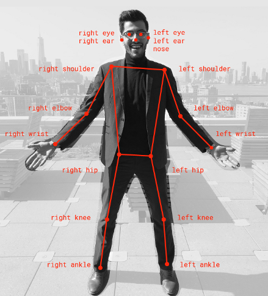

DEEP Open Catalogue: Pose Estimation
====================================

[](https://jenkins.indigo-datacloud.eu/job/Pipeline-as-code/job/DEEP-OC-org/job/posenet-tf/job/master/)


**Author:** [Lara Lloret Iglesias](https://github.com/laramaktub) (CSIC)

**Project:** This work is part of the [DEEP Hybrid-DataCloud](https://deep-hybrid-datacloud.eu/) project that has received funding from the European Union’s Horizon 2020 research and innovation programme under grant agreement No 777435.

This is a plug-and-play tool for real-time pose estimation using deep neural networks. The original model, weights, code, etc. was created by Google and can be found at [here](https://github.com/tensorflow/tfjs-models/tree/master/posenet). PoseNet can be used to estimate either a single pose or multiple poses, meaning there is a version of the algorithm that can detect only one person in an image/video and one version that can detect multiple persons in an image/video. The module implemented here works on pictures (either uploaded or using an URL) and gives as output the different body keypoints with the corresponding coordinates and the associated key score. It also generates an image with the keypoints superimposed.

<p align="center">

</p>

To start using this framework run:

```bash
git clone https://github.com/deephdc/posenet-tf
cd posenet-tf
pip install -e .
```

 **Requirements:**
 
- This project has been tested in Ubuntu 18.04 with Python 3.6.5. Further package requirements are described in the `requirements.txt` file.
- It is a requirement to have [Tensorflow>=1.12.0 installed](https://www.tensorflow.org/install/pip) (either in gpu or cpu mode). This is not listed in the `requirements.txt` as it [breaks GPU support](https://github.com/tensorflow/tensorflow/issues/7166). 
- Run `python -c 'import cv2'` to check that you installed correctly the `opencv-python` package (sometimes [dependencies are missed](https://stackoverflow.com/questions/47113029/importerror-libsm-so-6-cannot-open-shared-object-file-no-such-file-or-directo) in `pip` installations).


<p><small>Project based on the <a target="_blank" href="https://drivendata.github.io/cookiecutter-data-science/">cookiecutter data science project template</a>. #cookiecutterdatascience</small></p>


## Test

You can test the posenet module on a number of tasks: predict a single local image file (or url) or predict multiple images (or urls). 


## Running the API

To access this package's complete functionality (both for training and predicting) through an API you have to install the [DEEPaaS](https://github.com/indigo-dc/DEEPaaS) package:

```bash
git clone https://github.com/indigo-dc/deepaas
cd deepaas
pip install -e .
```

and run `deepaas-run --listen-ip 0.0.0.0`.
From there you will be able to run training and predictions of this package  using `model_name=posenetclas`.


